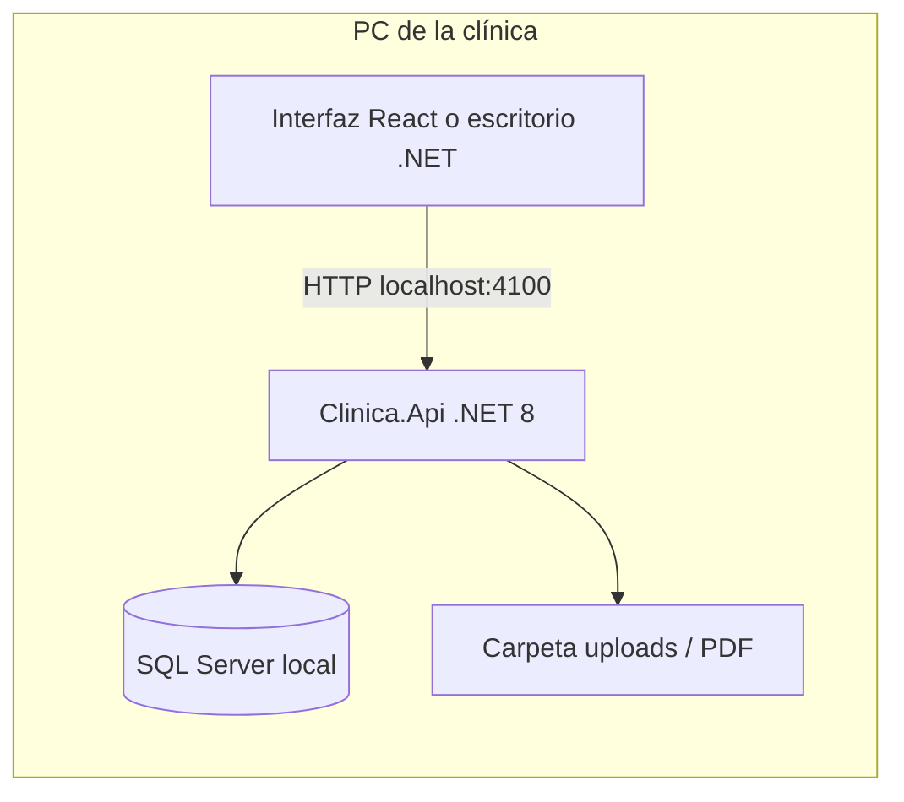

# Clínica Integral — Aplicación de escritorio

## Base tecnológica (objetivo)

| Capa | Tecnología |
|------|------------|
| **Lógica y API** | C# / .NET 8 (ASP.NET Core) |
| **Datos** | SQL Server **local** (LocalDB, Express o instancia en la misma PC) |
| **Interfaz actual** | React (navegador en `localhost`) — cliente del API local |
| **Interfaz escritorio (evolución)** | WPF / WinUI / Avalonia consumiendo el mismo API o `Clinica.Core` + EF directo |

Todos los datos (pacientes, historias, citas, pagos y documentos) residen en la máquina de la clínica, sin depender de la nube.

## Módulos de gestión integral

| Módulo | Entidades SQL | API | Pantalla |
|--------|---------------|-----|----------|
| **Pacientes** | `pacientes` | `/api/pacientes` | Pacientes |
| **Historia clínica** | `consultas` | `/api/consultas` | Expediente → Historia |
| **Citas / agenda** | `citas`, `medicos` | `/api/citas`, `/api/medicos` | Agenda |
| **Pagos** | `pagos` | `/api/pagos` | Pagos |
| **Documentos médicos** | `estudios_clinicos`, `recetas`, `ordenes_laboratorio` | `/api/estudios`, `/api/recetas`, `/api/ordenes-laboratorio` | Expediente (pestañas) |

Complementos: tratamientos, dashboard, notificaciones, membrete de clínica (`clinica_config`).

## Arquitectura en la PC de la clínica



## SQL Server local — opciones

1. **Windows (recomendado en clínica):** LocalDB o SQL Server Express — `appsettings.json` / `appsettings.Desktop.json`
2. **Linux (desarrollo):** Docker `docker compose up -d sqlserver` — `appsettings.Development.json`

Base de datos: **`ClinicaIntegral`**. Las tablas se crean al iniciar la API (EF Core `EnsureCreated` + seed).

## Modo escritorio (configuración)

```bash
export ASPNETCORE_ENVIRONMENT=Desktop
npm run backend
```

Usa `appsettings.Desktop.json`: LocalDB, carpeta de datos bajo el perfil del usuario y API solo en `127.0.0.1`.

## Publicación para una sola PC

1. Instalar [.NET 8 Runtime](https://dotnet.microsoft.com/download/dotnet/8.0) y SQL Server Express / LocalDB.
2. Publicar API: `dotnet publish backend/Clinica.Api/Clinica.Api.csproj -c Release -o ./publish`
3. Compilar frontend: `npm run build --prefix frontend` y copiar `frontend/dist` a `publish/wwwroot` (cuando se active el host estático).
4. Acceso: abrir navegador en `http://127.0.0.1:4100` o atajo al instalador.

## Aplicación Electron (UI web en ventana de PC)

La opción recomendada si ya usas la versión web: misma interfaz React dentro de **Electron**.

| Script | Descripción |
|--------|-------------|
| `npm run electron:dev` | API + Vite + ventana Electron (desarrollo) |
| `npm run electron:dist` | Build web + API + Electron con archivos estáticos |
| `npm run electron:build` | Genera instalador (NSIS/AppImage) |

Requisitos: Node.js, .NET 8, SQL Server local. Electron arranca el API en `4100` si `CLINICA_AUTO_API` no es `0`.

## Aplicación de escritorio nativa (Avalonia)

Proyectos en la solución:

| Proyecto | Rol |
|----------|-----|
| **`Clinica.Core`** | Entidades EF, `DbContext`, seed |
| **`Clinica.Api`** | API REST (opcional si solo usas escritorio) |
| **`Clinica.Desktop`** | UI **Avalonia** (.NET 8) — acceso directo a SQL Server |

### Arrancar escritorio (Linux con SQL Docker)

```bash
npm run sql:up
npm run desktop
```

En **Windows** con LocalDB: `set DOTNET_ENVIRONMENT=Desktop` y `dotnet run --project backend/Clinica.Desktop`.

Módulos en la app: panel general, pacientes (alta/edición), citas, pagos, expediente (historia + documentos).
